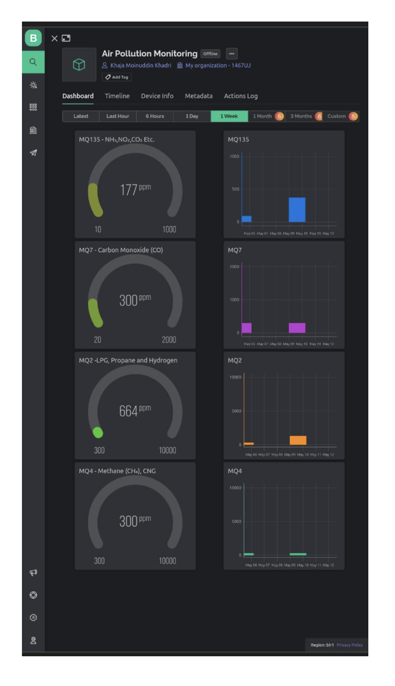

# IoT-based Air Pollution Monitoring System (Major Academic Project)

The IoT-based Air Pollution Monitoring System is a major academic project designed to monitor and analyze air quality in real-time. This system utilizes various sensors, microcontrollers, and Blynk as the cloud platform to collect, process, and visualize air quality data. It provides valuable insights into pollution levels and helps in making informed decisions for environmental well-being.

## Table of Contents

- [Features](#features)
- [Technologies Used](#technologies-used)
- [How to Use](#how-to-use)
- [Architecture](#architecture)
- [License](#license)

## Features

- **Real-time Data Monitoring**: Continuously monitors air quality data from multiple sensors.
- **Blynk Integration**: Sends collected data to the Blynk cloud platform for storage and real-time visualization.
- **Web/Mobile Interface**: Access air quality information through the Blynk mobile app and web dashboard.
- **Air Quality Index (AQI) Calculation**: Calculates AQI based on sensor data to indicate pollution levels.
- **Alert System**: Sends notifications within the Blynk app when pollution levels reach dangerous thresholds.
- **Historical Data Analysis**: Allows users to analyze historical air quality trends through the Blynk app.

## Technologies Used

- **Microcontrollers**: Utilizes ESP32 and other microcontrollers to interface with sensors.
- **Sensors**: Incorporates MQ2, MQ4, MQ7, MQ135 sensors to measure various air pollutants.
- **Blynk**: Blynk is used as the cloud platform for data storage, visualization, and alerts.
- **Blynk Mobile/Web App**: Provides a user-friendly interface to access real-time and historical air quality data.
- **Data Visualization**: Visualizes air quality data using charts and graphs within the Blynk app.

## How to Use

1. **Setup Hardware**: Connect the sensors (MQ2, MQ4, MQ7, MQ135) to the ESP32 microcontroller as per the provided circuit diagram.
2. **Blynk Setup**: Create a new project in the Blynk app and obtain the authentication token.
3. **Install Dependencies**: Install required libraries and dependencies on your microcontroller for Blynk integration.
4. **Configuration**: Configure the microcontroller with necessary Wi-Fi credentials and Blynk authentication token.
5. **Upload Code**: Upload the provided Arduino code to the microcontroller using the Arduino IDE.
6. **Access Data**: Access real-time and historical air quality data through the Blynk mobile app and web dashboard.
7. **Receive Alerts**: Receive alerts and notifications within the Blynk app if pollution levels cross predefined thresholds.

## Architecture

The hardware components such as the ESP32 board, gas sensors and other components need to be soldered or connected with wires. Next, the firmware for the ESP32 board needs to be developed using programming languages like Arduino IDE. This firmware should be able to read the sensor data, convert it into meaningful values,
and transmit it to the cloud server or a mobile application using the Wi-Fi connectivity feature of ESP32.
After developing the firmware, it needs to be uploaded to the ESP32 board. This can be done using a USB cable and a computer. Once the hardware and firmware are ready, the system needs to be calibrated to ensure accurate readings from the gas sensors. This involves exposing the sensors to known concentrations of gases and adjusting the calibration settings in the firmware. 
Finally, the system needs to be tested and evaluated in real-world conditions. This involves installing the system in the desired location, monitoring the data readings, and ensuring that the system is functioning as intended.

## License

This project is open-source and available under the [MIT License](LICENSE).
